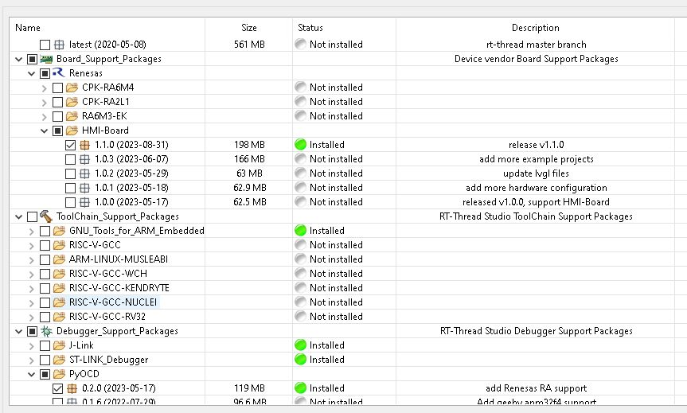
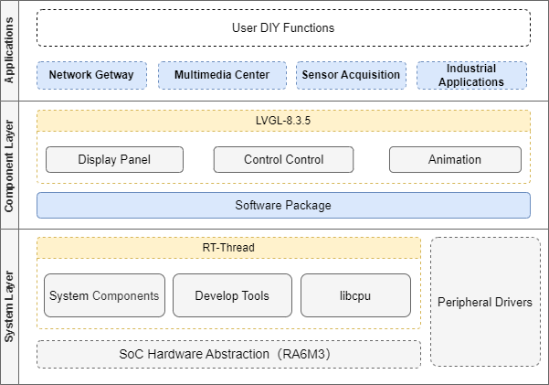
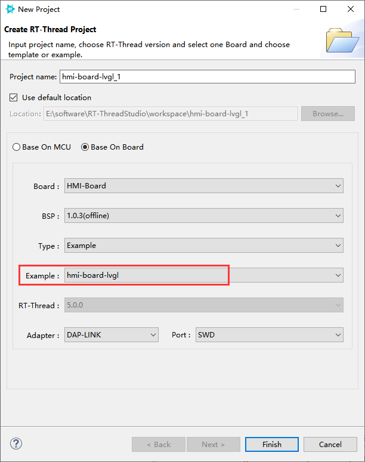

# LVGL Contest Demo


## Build and Deploy
 * [RT-Thread Studio](https://www.rt-thread.io/studio.html)
   * Install HMI-Toolchain
   * Make sure that PyOCD DAP is the newest revision (otherwise the files won't flash)
   * Make sure you install the latest GNU_Tools_for_ARM_Embedded (i.e. the 5.4.1 doesn't have proper LTO support)



 * Scons build on Linux
   * Install the [GNU ARM 10.3 toolchain](https://developer.arm.com/-/media/Files/downloads/gnu-rm/10.3-2021.10/gcc-arm-none-eabi-10.3-2021.10-x86_64-linux.tar.bz2)
     * Make sure it is in path 
   * Make sure you have scons installed `sudo apt-get install scons`
   * On the console 
```bash
source ./envsetup.sh
scons --verbose
```

## Entry Points
```
 +-+ src
   +- gui_entry.c: Mostly LCD/Event handlers Main entry point for GUI handling, called out of LVGL RT-Thread port
   +- hal_entry.c: Mostly I/O Main entry point for HAL, called out of RT-Thread
```

----
Original docs

# RA6M3-HMI-Board-LVGL Reference Design Guide 

Get ready to rock with our LVGL music player demo, designed for the HMI-Board development board. Built on the RT-Thread operating system and compatible with RT-Thread Studio/MDK5 software development environment, this design is powered by the RA6M3 central control chip. With features like 2D acceleration, JPEG encoding and decoding, and 2M Flash large-capacity storage control, you’ll have everything you need to create amazing graphic applications.

Our reference design comes pre-loaded with the LVGL music player, boasting a stunning playback interface and easy-to-use controls. Just hit play/pause or skip to the next track right from the main screen.

This guide has got you covered with technical architecture, usage instructions, and resources and documentation. Dive in to evaluate the graphic performance of the RA6M3 chip and start building on this reference design for your own secondary development.

## Technical Architecture

HMI-Board-LVGL technical architecture includes the System Layer, the Components Layer and the Applications layer. 



### System Layer

RT-Thread was born in 2006, it is an open source, neutral, and community-based real-time operating system (RTOS). RT-Thread has not only just a real-time kernel, but also rich components. 

It includes:

- Kernel layer: RT-Thread kernel, the core part of RT-Thread, includes the implementation of objects in the kernel system, such as multi-threading and its scheduling, semaphore, mailbox, message queue, memory management, timer, etc.; libcpu/BSP (Chip Migration Related Files/Board Support Package) is closely related to hardware and consists of peripheral drivers and CPU porting.
- Components and Service Layer: Components are based on upper-level software on top of the RT-Thread kernel, such as virtual file systems, FinSH command-line interfaces, network frameworks, device frameworks, and more. Its modular design allows for high internal cohesion inside the components and low coupling between components.
- [RT-Thread software package](https://packages.rt-thread.org/en/index.html): A general-purpose software component running on the RT-Thread IoT operating system platform for different application areas, consisting of description information, source code or library files. RT-Thread provides an open package platform with officially available or developer-supplied packages that provide developers with a choice of reusable packages that are an important part of the RT-Thread ecosystem. The package ecosystem is critical to the choice of an operating system because these packages are highly reusable and modular, making it easy for application developers to build the system they want in the shortest amount of time. RT-Thread supports 600+ software packages.

### Component Layer

The HMI-Board goes above and beyond with system-level support and integration of several top-notch system components. The LVGL multimedia component has been added to our example project for your convenience. All developers need to do is enable the LVGL software package in RT-Thread Studio/env and pull it from the server to add LVGL to their development project as a component. It’s that easy! No more complicated steps or manual additions - just improved efficiency and a smoother development process.

### Application Layer

The application layer in LVGL allows for the development of secondary user interfaces. Users can integrate their pre-existing or newly developed UI code at this level.

Music Player Demo:

Easily control the music player on the touch panel by playing/pausing or skipping to the next track directly from the main screen. Access the music list by pulling up the panel control. The code can also be modified to switch from manual to automatic playback.

## How to Use

With RT-Thread Studio, you have the option to create an LVGL-Demo using a sample project. Once the project is set up, all you need to do is compile and upload it.

> For more information on installing and using RT-Thread Studio, check out the [[Quick Start]](https://www.rt-thread.io/document/site/rtthread-studio/um/studio-user-manual/) guide.



This image illustrates how the LVGL package is integrated within RT-Thread. Users have the ability to configure LVGL using a visual interface.


## Resources and Documentation

For LVGL UI development, you can visit the LVGL official website and documentation center for more detailed information:

- [LVGL - Light and Versatile Embedded Graphics Library](https://lvgl.io/)
- [LVGL documentation](https://docs.lvgl.io/8.3/)
